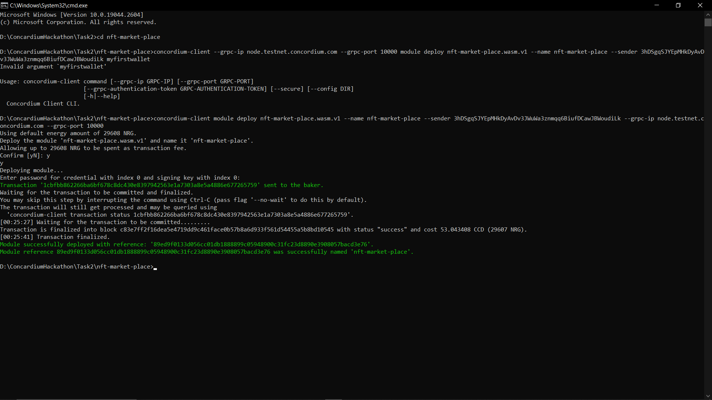

# Concordium Task-2
# TASK 2 Deploy Your First-Smart Contract
## Mainnet Address: ```4qF7MCiS6FDhTYhX2KecqPjHr2A4b28Z1gmLUb6THr3AmG6Pe6```
## Contract address: ```89ed9f0133d056cc01db1888899c05948900c31fc23d8890e3908057bacd3e76```
### Transaction Hash: ```1cbfbb862266ba6bf678c8dc430e8397942563e1a7303a8e5a4886e677265759```

## Steps
### Install the cargo genereate V0.16.0 

### Cargo init

### cargo concordium test

### cargo concordium build

### Deployment of Contract

```
